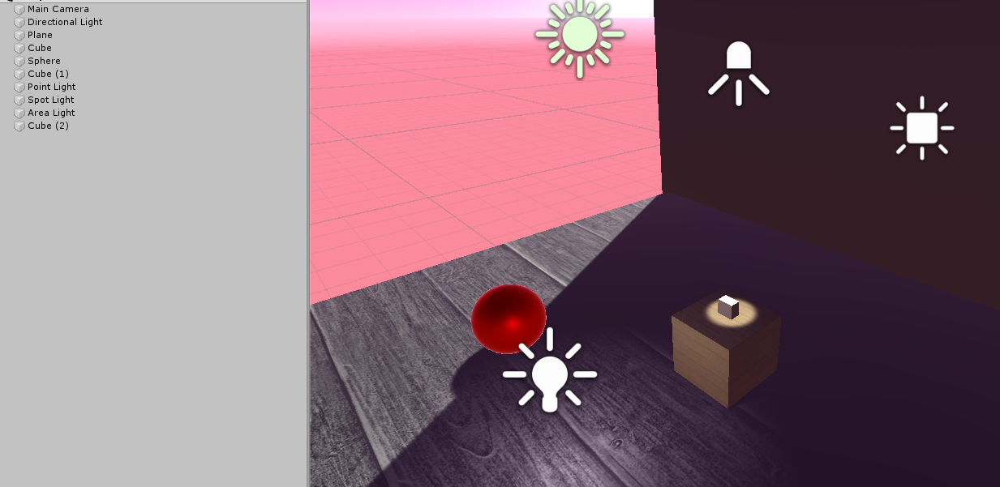

# CMPM163

I changed the particles from the tutorial to look like red sparks coming from the back of the wheels, and then spent some time figuring out unity's shaders work and made a interesting shader by changing the players uv by a sin function
